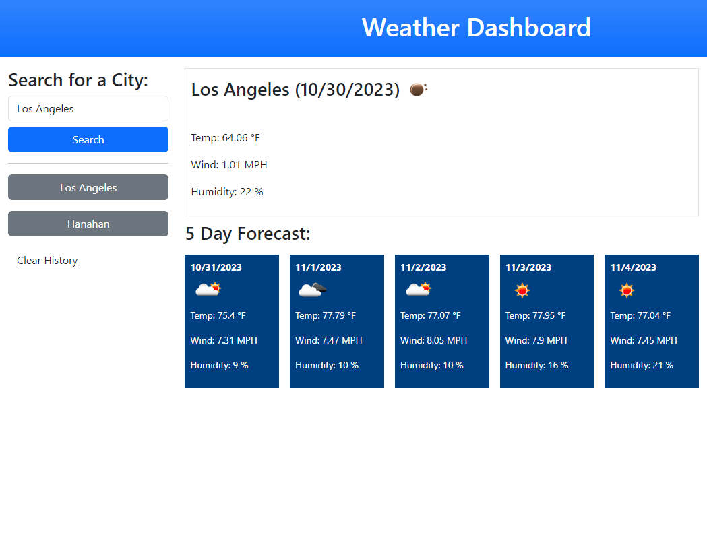

# Weather_Search

## Description

This readme contains information on the Weather Dashboard website that I have created using HTML, CSS, and Javascript. The link to the deployed live site can be found in the "Links" section of this readme. All buttons and links in the deployed website are functioning properly. This Weather Dashboard website allows users to search for the current weather conditions for cities. This website will also display a five day forecast for the city that was searched for. A list of the most recent cities searched for are also listed on the page. The weather data displays information for temperature, wind speed, and humidity.

## Installation

N/A

## Usage

In order to use this website, the user must enter a city into the search bar and click "Search". The user is then given information regarding current weather conditions and a five day forecast is displayed. The user can also click on the most recent cities searched for, to get weather information for that city. The user is also able to clear the search history for recent cities.

## Links

Github repository URL: https://github.com/JarettDeSanti/Weather_Search  
Deployed live site URL: https://jarettdesanti.github.io/Weather_Search/

## Screenshot

## Acknowledgements

Guidance with this project was given by tutor Corey Yates and Jason Stoyles.

## Credits

N/A

## License

Please refer to the LICENSE in the repository.

## Badges
N/A

## Features
N/A

## How to Contribute
N/A

## Tests
N/A
